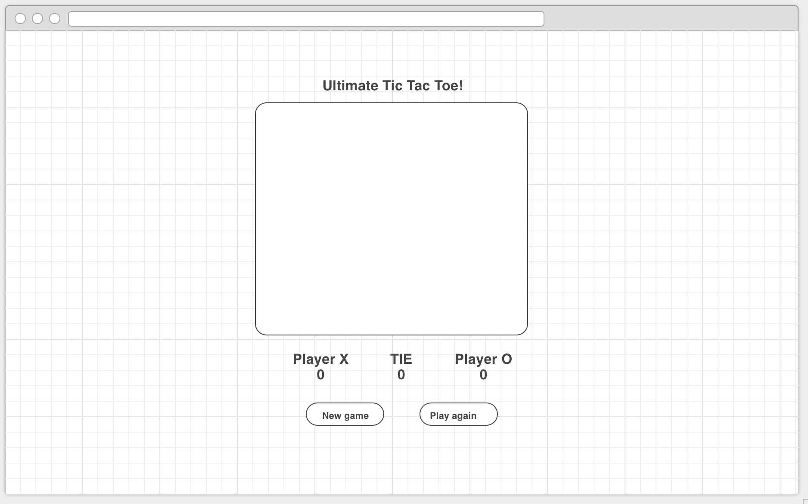

# ATL WDI Project #1 : Tic Tac Toe  
  
  
## **Overview:**  

Create a fully functional Tic Tac Toe game using the knowledge I have acquired during the first two weeks of WDI class. 

[Live Demo](http://haesol87.github.io/TIC.TAC.TOE./)
	
## **Key Goals:**

- Create board using HTML/CSS.
- Place "X" and "O" with user input.
- Keep track of player scores.
- Be able to replay game.  
 
## **Planning**: 

Wireframe: 

[Trello Website](https://trello.com/b/ewDkKXAl/project-tic-tac-toe)

## **Tools Used:**

HTML5, CSS3, jQuery, JavaScript,
Trello, Wireframe, SublimeText3, Google

## **Bottle Necks:**

- Board cells kept going out of line after move was placed. 
- Reinitialize the board without turning off the mouse click event handler. 
- Using CSS to position my game layout.

## **Above and Beyond:**

* Create a player vs computer mode. 
* Create advanced AI level mode. 

## **Future Upgrade Plan:**

Make the game compatible with other browsers.

## **Lesson Learned:**  
 
 
- When positioning your elements start with the big ones and narrow it down. 
- Utilize chrome developer tools to observe behavior.
- Create better testing environment and procedures.
- Time management / Project management : Set priorities and make development decisions as the project flows.